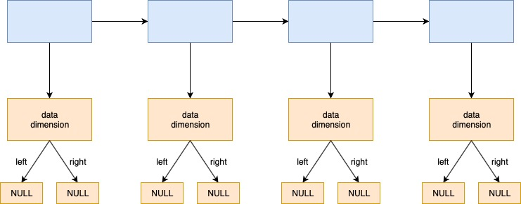

# HW18. Hierarchical Clustering (A)


**Please read the entire file before you ask any question.**

In this assignment you will partition a LinkedList. This is a precursor to HW19. We will be building the basic building blocks to perform hierarchical clustering.

## Learning Goals
* Learn to Use Dynamic Structures.

## What is Hierarchical Clustering?
* HW04 asked you to cluster data into `k` groups using the k-mean algorithm, where `k` is a number given to your program. However, we now implement a clusering algorithm that does not require us to select the value of `k` before hand.

#### Please read the handout with this assignment. Due to copyright, the handout is distributed in Blackboard. Page 395 of "An Introduction to Statistical Learning" by Gareth James, Daniela Witten, Trevor Hastie, Robert Tibshirani (published by Springer) explains the algorithm.


# To Do
* Your makefile will have 1 input to your main function. (`argc` should be 2).
	* The input file.
	* Makefile example: `./hw18 inputs/test1.txt`

* The input data is available in the .txt files in the `inputs/` folder.

* **How will data be stored?**
	* For hierarchical clustering, we require a linked list.
	* Each node of the linked list contains a pointer to node of a tree. (Look at the structure definitions provided to you)
	
* **Requirements for HW18**
	* Initialize a Linked List.
	* First element of the file contains the number of of data points `n`. (Same as HW04)
	* Second element of the file contains the dimension of of data points `dim`. (Same as HW04)
	* Read the rest of elements from the input file, and store it in the `data` field of the structure `TreeNode`.
	* Use `dim` to fill in the `dimension` field of the structure `TreeNode`.
	* Popululate the entire Linked List (each datapoint is an individual node).
	* Walk through the Linked List to find the two elements which have the smallest square of the [Euclidean distance](https://en.wikipedia.org/wiki/Euclidean_distance) between them. (Look at following example)
	* Use the function `printAnswer()` to print your result.
	
* **Examples**
### HOW TO READ THE DATA FROM THE INPUT FILES?
* If `n` = 3, `dim` = 2, Input File Contents are: 
	```
	1 2
	3 4
	5 6
	```
Then your datapoints should be: `(1,2)` `(3,4)` `(5,6)`
	
* If `n` = 2, `dim` = 3, Input File Contents are: 
	```
	1 2 3
	4 5 6
	```
Then your datapoints should be: `(1,2,3)` `(4,5,6)`
	
### WHAT DO WE MEAN BY MINIMUM DISTANCE?
* Find the <strong>square</strong> of the [Euclidean distance](https://en.wikipedia.org/wiki/Euclidean_distance) between each pair of datapoints.
	* if the points are `(1,2)` `(10,10)` `(2,3)`
	* the distances between the pairs of nodes are shown below
	
|         | (1,2) | (10,10) | (2,3) |
|---------|-------|---------|-------|
| (1,2)   | -     | 145     | 2     |
| (10,10) | -     | -       | 113   |
| (2,3)   | -     | -       | -     |
	
	```
	The two elements with minimum separation would be: (1,2) and (2,3)
	
	```

### WHAT SHOULD THE DATA STRUCTURE LOOK LIKE?

#### This is an representation of the data structure. The blue boxes indicate ListNodes, the orange boxes indicate TreeNodes. In HW18, the left and right childern of the TreeNodes will be NULL. But we will use them in HW19.


# Functions to Complete
#### int main(int argc, char * * argv)
	* check for input errors. (incorrect `argc`)
	* declare file pointer.
	* call `LinkedListCreate`
	* call FindMin

#### void LinkedListCreate(ListNode * * head, int n, int dim, FILE* fptr)
	* `head` is the head of the Linked List
	* `n` is the number of datapoints.
	* `dim` is the dimension of each datapoint.
	* `fptr` is the file pointer declared in `main`.
	* read from the `fptr` into an array.
	* use `CreateNode` to create new nodes for the Linked List, pass the array to `CreateNode`.
	
#### ListNode* CreateNode(int n, int dim, int* arr)
	* `n` is the number of datapoints.
	* `dim` is the dimension of each datapoint.
	* `fptr` is the file pointer declared in `main`.
	* initialize all the field of the ListNode and TreeNode, and return the appropriate value.
	* read from the array to populate the `data` field in `TreeNode`.
	
#### int FindDist(TreeNode* x, TreeNode* y)
	* find [Euclidean distance](https://en.wikipedia.org/wiki/Euclidean_distance) between two nodes' `data` fields.
	* return `int` value.
	
#### void FindMin(ListNode* head)
	* find pair of ListNodes with least distance between them.
	* call the print function with the two nodes.
	
# Keep In Mind

* **In order to grade your assignments correctly, all the data that we would work with is going to be of type `int`. 
Due to the precision errors in floats, and doubles they will be avoided in assignments HW18 and HW19.**

* **Once you have found the elements with the least distance between them, (before you call the print function), ensure the value with the smaller treenode->data[0] is the first parameter. If treenode->data[0] is the same, then compare treenode->data[1], and so on.**

* **Remember the difference between `->` operator, and the `.` operator while referencing fields of a structure.**

* **We will use these functions to perform clustering in HW19**
	


#### Flags to include
Please also include the following define flags for your Makefile.

```bash

-DTEST_MAIN -DTEST_CREATENODE -DTEST_LINKEDLISTCREATE -DTEST_DIST -DTEST_MIN

```

Type the following command to zip your file.
```bash
	zip hw18.zip hw18.c main.c
```
**You will not get any credits if the submitted file is not zipped**

The **only** way to submit homework is through Blackboard.

If your program has any compilation error or warning (remember to use
`gcc -std=c99 -g -Wall -Wshadow --pedantic -Wvla -Werror`), you will
receive zero in this assignment.
